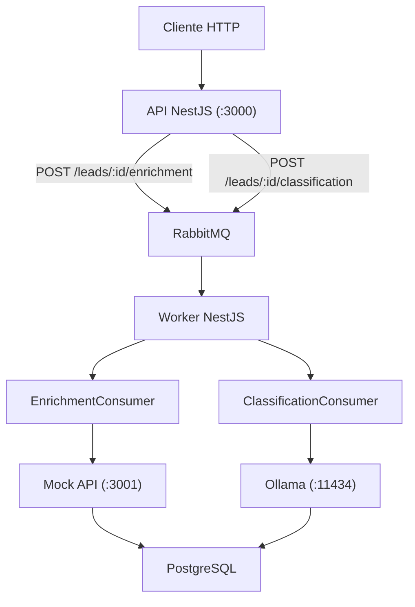

# Backend Challenge

> Sistema de gestão de leads com enriquecimento de dados e classificação por IA.
> Leia o [CHALLENGE-DESCRIPTION.md](./CHALLENGE-DESCRIPTION.md) para entender o escopo completo.

## Requisitos

- Node.js 20+
- Docker + Docker Compose

## Setup

### 1. Clone e instale as dependências

```bash
git clone https://github.com/seu-usuario/backend_challenge
cd backend_challenge
npm install
```

### 2. Configure as variáveis de ambiente

```bash
cp .env.example .env
cp .env.test.example .env.test
```

### 3. Suba os serviços

```bash
docker compose up -d
```

Isso sobe PostgreSQL, RabbitMQ, Ollama e a Mock API.

### 4. Baixe o modelo de IA

```bash
docker exec ollama ollama pull tinyllama
```

### 5. Rode as migrations e o seed

```bash
npx prisma migrate deploy
npx prisma db seed
```

### 6. Inicie a aplicação

Em terminais separados:

```bash
# API
npm run start:dev

# Worker
npm run start:worker
```

A API estará disponível em `http://localhost:3000`.

## Testes

```bash
# Unitários
npm test

# Integração (requer Docker rodando)
npm run test:integration

# Todos
npm run test:all
```

## Endpoints

### Leads

```
POST   /leads                     Criar lead
GET    /leads                     Listar leads (com filtros)
GET    /leads/:id                 Detalhar lead
PATCH  /leads/:id                 Atualizar lead
DELETE /leads/:id                 Remover lead
GET    /leads/export              Exportar CSV
```

### Enriquecimento

```
POST   /leads/:id/enrichment      Solicitar enriquecimento
GET    /leads/:id/enrichments     Histórico de enriquecimentos
```

### Classificação

```
POST   /leads/:id/classification  Solicitar classificação
GET    /leads/:id/classifications Histórico de classificações
```

### Filtros disponíveis em `GET /leads`

```
?source=WEBSITE
?fullName=joão
?companyName=tech
?enrichmentStatus=SUCCESS
?classificationStatus=FAILED
```

## Modelagem

```
Lead
├── LeadEnrichment (1:N)
│   ├── status: PENDING | SUCCESS | FAILED
│   ├── rawData: resposta completa da Mock API
│   └── campos: email, phone, companyName, companyCnpj, estimatedValue
│
└── LeadClassification (1:N)
    ├── status: PENDING | SUCCESS | FAILED
    ├── score: 0–100
    ├── classification: Hot | Warm | Cold
    ├── commercialPotential: High | Medium | Low
    ├── justification: gerado pelo Ollama
    └── modelUsed: nome e versão do modelo
```

Cada enriquecimento e classificação gera um registro independente - o histórico é imutável e auditável.

## Arquitetura



## Decisões técnicas

**Duas filas separadas** - `leads_enrichment_queue` e `leads_classification_queue` isolam falhas entre os pipelines e permitem escalar os workers de forma independente.

**Histórico imutável** - reprocessar um lead sempre gera um novo registro. Nada é sobrescrito, o que permite comparar execuções e auditar falhas ao longo do tempo.

**Classificação determinística** - o Ollama gera `score` e `justification`. `classification` e `commercialPotential` são derivados do score no código, evitando inconsistências do modelo.

**Soft delete** - leads removidos mantêm `deletedAt` preenchido e são excluídos de todas as queries, preservando a integridade referencial com os registros de enriquecimento e classificação.

**Mock API dockerizada** - sobe junto com `docker compose up`, sem dependência externa. Recebe o CNPJ e retorna dados fictícios no formato da API real.
